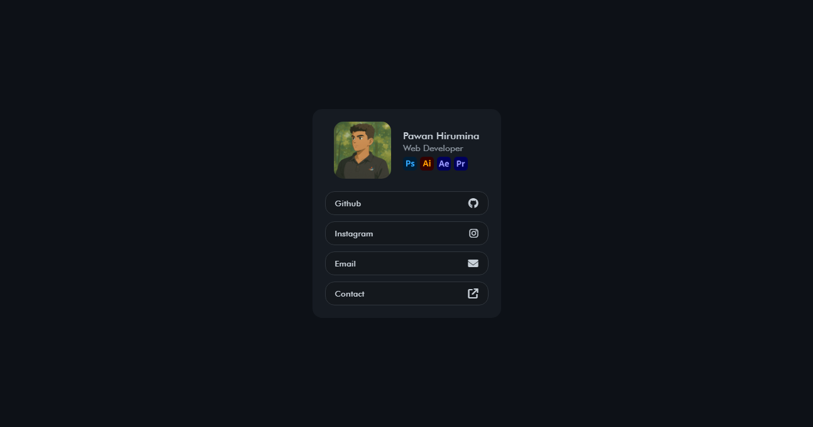

# 🌐 Developer Profile Card

This is a modern, responsive personal profile card built with **HTML, CSS, and JavaScript**. It's perfect for showcasing your portfolio, contact links, and favorite tools on a single beautiful card.



## ✨ Features

- 👨‍💻 Developer avatar
- 🎨 Tool badges (Adobe Suite)
- 🔗 Interactive contact links with icons
- 🌙 Dark mode design

## 🚀 Technologies Used

- HTML5
- CSS3
- JavaScript (basic interactivity)

## 📦 Usage

1. Clone the repository:
   ```bash
   git clone https://github.com/pawanhirumina/simple-profile-card.git
   cd simple-profile-card
   ```
2. Open index.html in your browser.

3. Customize with your own:

   - Name & Avatar

   - Social/Contact links

   - Icons or tools you use

## 🖼 Customization Tips

- Replace `src` with your own image.

```html
<div class="profile_image">
  
</div>
```

- Replace the `YOUR_API_KEY` in the contact form with your own `WEB3FORMS` Api Key

```html
<div class="card_contact" id="contact-page">
  <form
    action="https://api.web3forms.com/submit"
    method="POST"
    id="form"
    autocomplete="on"
    novalidate
  >
    <input type="hidden" name="access_key" value="YOUR_API_KEY" />
  </form>
</div>
```

- Update social media links in the HTML. - Edit colors in style.css to match
  your vibe.
